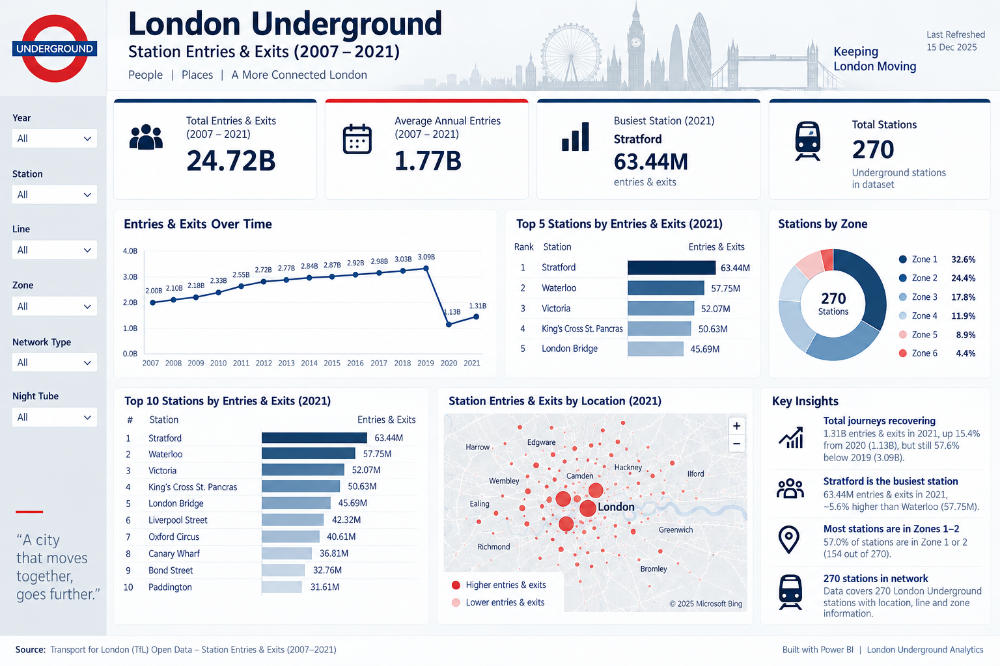

# London Underground Power BI Dashboard

A Power BI portfolio project exploring London Underground station entries and exits, station rankings and geographic patterns using TfL datasets covering 2007–2021.

## Original dashboard preview

This is the original dashboard design, including its KPI cards, trend chart, station rankings, map, zone breakdown and filter controls. The image is a static screenshot; an editable Power BI model is not included in this repository.

## Tools and skills

- **Power BI** — dashboard design and visualisation
- **Power Query** — data preparation
- **DAX** — measures and KPI calculations
- **Excel / CSV** — source data
- **Data modelling and storytelling** — connecting station information and presenting findings

## Dashboard features

- Year, station, line, zone, network type and Night Tube filter controls
- Headline station-usage measures
- Historical entries and exits chart
- Top-five and top-ten station rankings
- Station distribution by zone
- Geographic station activity map
- Summary insight cards

These features describe the original report shown above. Filters are not interactive in the screenshot.

## Data and interpretation notes

The original image is preserved as the project reference. A subsequent source review found differences between some displayed figures and the original annual-count workbooks:

- The screenshot's **24.72B** total and **1.77B** annual average do not reconcile with its plotted annual values and stated 15-year period.
- The displayed **63.44M** Stratford figure combines several rail modes in the 2021 workbook. The **LU-only** Stratford value is **29.11M**.
- Filtering the original 2021 workbook to `Mode = LU` gives **King's Cross St. Pancras** as the busiest Underground station at **36.73M**, and **1.181B** annualised entries and exits across **270** station records.
- The source-based checks cover the supplied 2007–2017 annual workbook and the 2021 workbook. Original annual workbooks for 2018–2020 are not included; the derived CSV contains those years but mixes modes at some interchanges.
- Entries and exits count station movements, not unique passengers or journeys. Annualisation methods and station coverage can vary across years.

These review findings are recorded separately from the original visual. The image's affected totals, rankings, percentage comparisons and zone shares should not be treated as independently validated results. The original Power BI model would be needed to correct its measures while preserving the report design.

## Business relevance

The report illustrates how station usage, rankings and geographic comparisons can support further investigation into network demand. Operational decisions would also require reliable mode-specific definitions, peak-hour information and checks of source coverage.

## Source references

- [TfL open-data information](https://tfl.gov.uk/info-for/open-data-users/our-open-data)
- [TfL crowding and annual-count portal](https://crowding.data.tfl.gov.uk/)
- [Historical annual-count workbook](multi-year-station-entry-and-exit-figures.xls)
- [2021 annualised-count workbook](AC2021_AnnualisedEntryExit.xlsx)

Retain TfL attribution and consult the publisher's reuse terms when redistributing the source data.

## Repository files

| File | Purpose |
|---|---|
| `London_Underground_Dashboard.png` | Original dashboard screenshot |
| `multi-year-station-entry-and-exit-figures.xls` | Historical annual-count source workbook |
| `AC2021_AnnualisedEntryExit.xlsx` | 2021 annualised-count source workbook |
| `TfL_stations.csv` | Combined station-usage dataset |
| `Stations_20220221.csv` | Station attributes and coordinates |
| `lu_lines.geojson`, `night_tube.geojson` | Geographic source files |
| `verified_annual_totals.csv` | Supporting annual-total checks added during documentation review |
| `verified_2021_stations.csv` | Supporting LU-only 2021 checks added during documentation review |

**Vaibhav Panchal**
